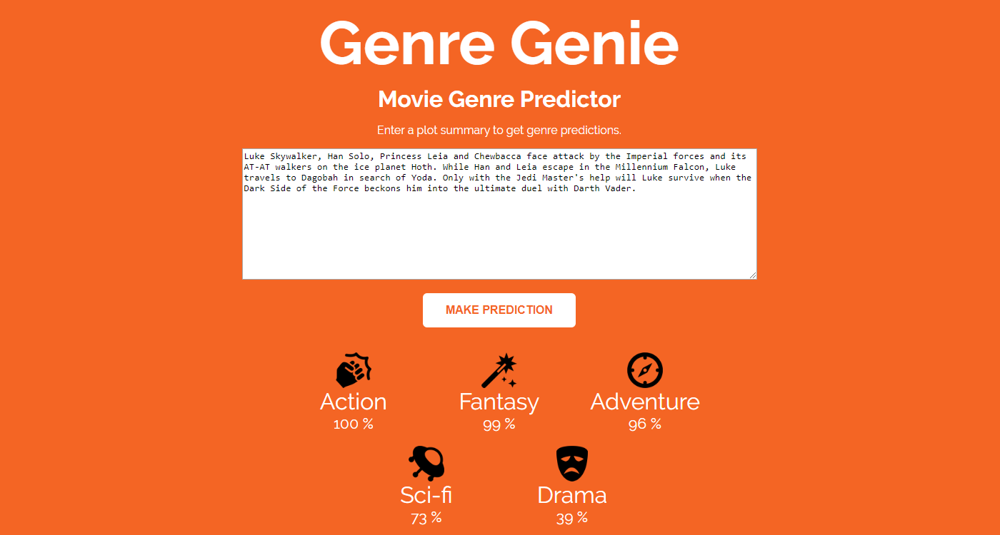
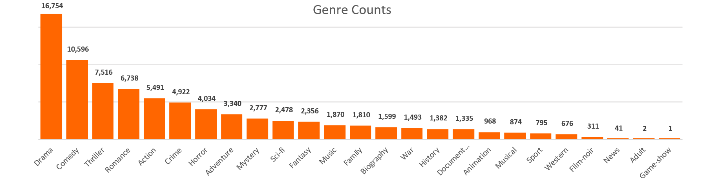
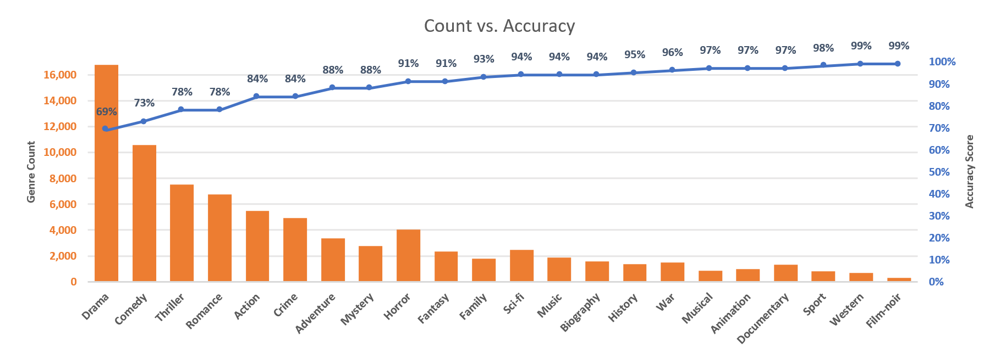
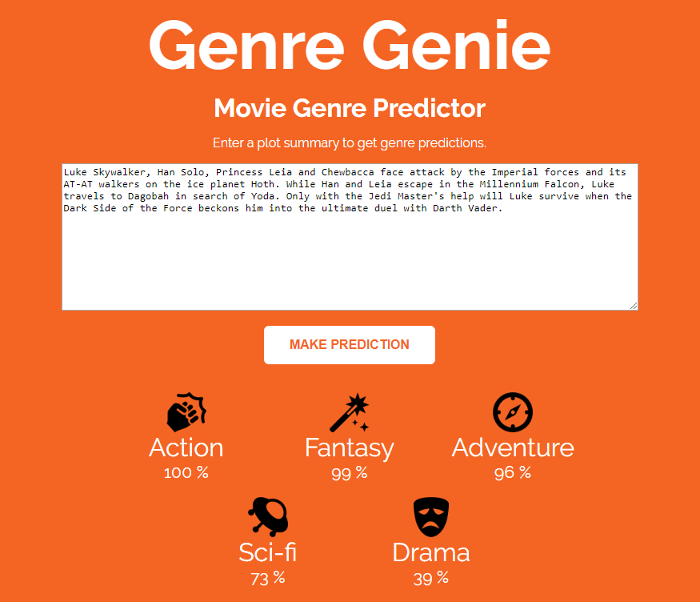

# Genre Genie - Movie Genre Predictions

## Multi-label Classification with Natural Language Processing

### Tom Keith - BrainStation Data Science Diploma Capstone - March 2020

**DEMO**: http://tomkeith.pythonanywhere.com/

---

### Genre Genie - Movie Genre Predictions

As a huge fan of movies and the information associated with them, countless hours have been spent on the Internet Movie Database (<a href="https://www.imdb.com/" target="_blank">IMDb</a>) looking up movie trivia, box office figures, following people through film (degrees of Kevin Bacon), and exploring movies similar to my favourites. Like many, I prefer movies of particular genres more than others. What makes a genre? Which words can ‘define’ a genre? How can data answer this question? These burning questions gave rise to Genre Genie.

Genre Genie has been trained on information from 30,000 movies - including brief plot summaries - with a goal of accurately predicting genres most associated to new, unseen plot summaries. I set out to tackle this multi-label classification problem by utilizing web scraping, natural language processing (NLP) and machine learning. A secondary goal was to create some sort of interactivity element for display and demonstration.

### Multi-label Classification

During my computer science undergraduate degree, I was in a database class learning about 'many-to-many' relationships – a relationship that is exemplified well with movies and genres. Simply put, a movie can have many genres associated with it, and a genre can be associated with many movies (hence 'many-to-many'). This is different than the classifications that more commonly occur as multi-class classification (or even binary classification) which is 'one-to-many'. For example, image classification of animals: dog, cat, horse, etc. The image can’t be classified as a dog *and* a horse, it can only be one – that is multi-*class* classification due to the fact the classifications are mutually exclusive. Movie genres are multi-*label* classifications and are **not** mutually exclusive – as best seen by the success of romantic comedies for example.

While multi-label classification comes with its own set of problems, it is still very much overlaps with multi-class classification. Sourcing articles handling multi-label classification with machine learning[<a href="https://towardsdatascience.com/multi-label-text-classification-with-scikit-learn-30714b7819c5" target="_blank">1</a>][<a href="https://towardsdatascience.com/journey-to-the-center-of-multi-label-classification-384c40229bff" target="_blank">2</a>], a popular method is a ‘OneVsRest’ approach, which will be discussed more later. Multi-label classifications have many real-world applications, especially with text classification. For example, news articles, blog websites, or like in the examples from sourced articles, toxicity level in comments.

### The Data

Finding data for this problem proved interesting, however the challenge was welcomed. IMDb has its own <a href="https://www.imdb.com/interfaces/" target="_blank">sets of open data</a>, which provided a great starting point, but lacked some major components needed to solve this problem. Most importantly, no text data (other than titles) was present to utilize NLP. Additionally, the dataset was limited to only the first (alphabetically) 3 genres, rather than the amount shown in more detail on IMDb.com - where a movie can have up to 7 genres.

Fortunately, this dataset has IMDB IDs (aka `tconst`) which can be extracted and utilized to scrape IMDb directly using their simple url construction - <a href="https://www.imdb.com/title/tt0076759/" target="_blank">imdb.com/title/tt0076759/</a> where `tt0076759` is the `tconst`. A list of over 30,000 movies' `tconst` values were fetched, with the conditions of having more than 1,000 rating votes and from the last 100 years (1920-2019). These thresholds were chosen with the assumption that if a movie has at least 1,000 rating votes, it's presumed to be accurate. I chose to go back 100 years for a representative sample distribution with variety across all genres, storylines and time periods.

Armed with 30,000+ IMDb IDs, I scraped IMDb for more information than required, seeking to have anything that could aid the model in making better predictions. Attempts at scraping a very long plot synopsis, potentially yielding in more text to train on, were halted when 2/3 of scrapes returned null. This resulted in using a shorter summary with an average of about 90 words, and no null values. This text and the additional numeric values scraped were evaluated for feature selection.

### EDA and Feature Selection

After scraping, some features just didn’t have enough data. For example, MPAA (the content rating of a movie) was missing for over 5,000 entries. After doing some research, the modern MPAA rating system didn't yet exist for many of the movies in my dataset (often just saying 'passed' rather than a rating 'PG13'). Additionally, the Metacritic rating was null for about half the data. These two features, along with the long synopsis mentioned above, were dropped altogether.

I featured engineered a word count (of the plot summary), in addition to the release month of movies. In the end, prior to pre-processing the text for NLP, I had 8 numerical features, and 1 text column consisting of - release year, release month, runtime, word count, IMDb rating, number of IMDb rating votes, number of user reviews and number of critic reviews.

The genres, our target variables, displayed some interesting trends. The representation among the genres were not balanced, however. For example, of all 25 genre tags, the top 4 (drama, comedy, thriller, romance) made up over 50% of all the genre tags (more on this in results). Movies associated with the bottom 3 (game-show, news, adult) were dropped altogether or absorbed into another genre. For example, 'news' genre proved redundant as it was always shared with 'documentary'. Ended with 22 genres.

### NLP Pre-processing and TF-IDF

Once I had my final dataset, I needed to convert the text into numerical values for modelling. To achieve this, we first need to pre-process the text before vectorizing it. I used a tokenizer to break down strings into single words, a stemmer to chop off the end of the words (and remove stop-words), a lemmatizer to change the word into their base form, and finally an un-tokenizer to put the words back into one string.

Once the text was pre-processed, Term Frequency-Inverse Document Frequency (TF-IDF) was used to transform the pre-processed text into vectorized numerical values. But first, and most importantly, the data must be split! 25% was set aside for a test set (75% train). When vectorizing, one n-gram (single words only) and a threshold of 20 for the minimum number of documents the word needed to appear in for it to count as a feature. Once the vectorizer had been fit on the train data, both sets of text from the train and test sets we transformed, then combined with the remaining features (including targets). Finally, exported separate ‘train’ and ‘test’ files where they will be used for modeling.

### Modeling with OneVsRest

Prior to fitting, as with most modeling, scaling was required. Both standard and min-max scalers were tested, however standard scaler proved better results.

When using a multi-label classifier, the target variable is not just one column, but many. My approach considered each label individually by fitting an independent model to each of the labels. This process is simplified using the 'OneVsRest' classifier that allows one model type to be passed (logistic regression) as a parameter, and the entire multi-dimensional target array then fitted.

OneVsRest takes each target column and evaluates it independently from the others (is it action, or not – hence 'one vs rest'). Thus, when the trained model predicts the label, it can output more than one label. Logistic regression proved to be the best model (vs Linear SVM) for this data set with the hyperparameters tuned (`C=0.01`, `solver='lbfgs'`). 

### Results

Similar to how the model is fitted one genre at a time, the results in the chart below are also independent of each other. The predicted values are checked against the target test set variables as an 'accuracy score'. As shown in the chart, the accuracy score is much higher for genres which are less represented (right-most), and the genres which have a greater representation have lower accuracy scores (left-most). These higher accuracies could be attributed to having more distinct words/data to identify that genre. The inverse is also true for the lower accuracies where there is too much overlap with other genres. Overall, the average genre accuracy was 90% - a score I consider 'good enough' for this application.

### Demo with Flask

While outside the scope of my initial goal, I wanted a fun way of demonstrating my model to the public on demo day. I created a Flask app where a user can input text (a plot summary) and the model will predict the genres most associated with that input text. All of the demo code is include in this project, and is temporarily available to demo here: http://tomkeith.pythonanywhere.com/

### Next Steps

This is an unbalanced dataset. There are many options to deal with unbalances data sets. Next steps could try to deal with this unbalanced set better than just using logistic regression, which handles the imbalance decently well. Over/under sampling, or looking into different scoring methods like f1 score, precision, recall and reviewing each of the 22 genres' confusion matrices would give a better understanding of how accurate the predictions are. Finally, applying a multi-label classification using NLP to a more business situation such as customer complaints, article/blog classification.

---

## PROJECT FILES AND FOLDERS

### Files

- **`1.1-imdb-datasets.ipynb`** - Explore IMDb datasets
- **`1.2-scraping-imdb.ipynb`** - Web scraper designed to scrape IMDb.com titles and export .tsv files.
- **`1.3-data-merge-clean-encode.ipynb`** - Merge scraped data from IMDb, clean, and binary encode the genres (from list format).
- **`2.1-eda.ipynb`** - EDA, feature engineering and prepare dataset for NLP preprocessing.
- **`2.2-data-preprocessing.ipynb`** - Pre-process text data, split into train and test sets, TF-IDF.
- **`3.1-modeling.ipynb`** - Fit and optimize multi-label classification model (OneVsRest) and measure accuracy.
- **`3.2-best-model.ipynb`** - Create final model from optimized hyperparameters on full dataset.
- **`3.3-wordclouds.ipynb`** - Bonus workbook only used to create a wordcloud in my presentation.

### Folders

- **`/data/`** - **Not all data has been included** due to file size limits. Full project with <a href="https://www.dropbox.com/sh/na8dzbpic4mo8fe/AABdryo23KpN6gtluH662xwha?dl=0" target="_blank">data files here</a>.
- **`/demo/`** - Local Flask app (run with predict.py). Alternatively, visit: http://tomkeith.pythonanywhere.com/
- **`/images/`** - Contains misc images used in report and workbooks.
- **`/models/`** - Contains only the best models (.pkl) and a few samples.
- **`/rawdata/`** - Contains 100 .tsv files of movie data, one for each year.

---
